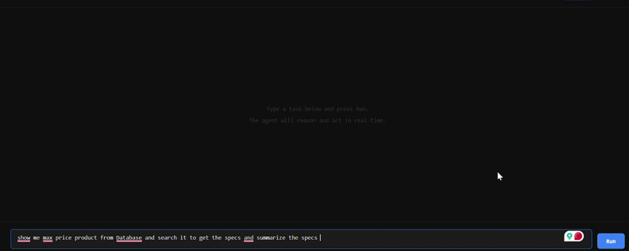

# react-agent-framework

A production-pattern ReAct agent framework with a pluggable tool registry, multi-provider abstraction (Gemini + Ollama), SSE-based trace streaming, and ABAC via JWT claims.



## Setup

```bash
pip install -r requirements.txt
```

Create a `.env`:

```env
GEMINI_API_KEY=...
SERP_API_KEY=...
JWT_SECRET=...
```

## Run

```bash
uvicorn main:app --reload --port 8000
```

UI available at `http://localhost:8000/ui`

## Endpoints

| Method | Path | Description |
|--------|------|-------------|
| `POST` | `/agent/run` | Run agentic task, stream trace via SSE |
| `POST` | `/chat` | Simple LLM completion, stream tokens via SSE |
| `GET` | `/health` | Provider health check |

## Auth

All `/agent/run` requests require a JWT in the `token` header encoding allowed providers and tools:

```json
{ "providers": ["gemini"], "tools": ["web_search", "db_query", "summarizer"] }
```

## License

MIT